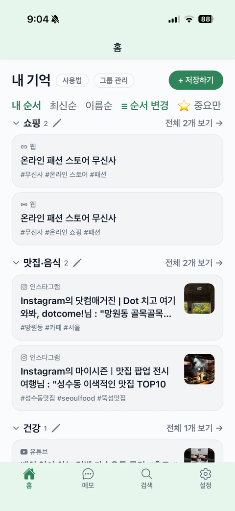

# 폴겟(Forget) 공식 홈페이지

공식 주소: https://forgetapp.kr  
호스팅: GitHub Pages  
저장소: `davidk0020/forget-web`

## 파일 구성

- `index.html`: 메인 랜딩 페이지
- `privacy.html`: 개인정보처리방침
- `terms.html`: 이용약관
- `support.html`: 지원 및 문의
- `styles.css`: 전체 디자인
- `assets/forget-icon.png`: 공식 앱 아이콘
- `assets/og-image.jpg`: 카카오톡·SNS 링크 미리보기 이미지
- `404.html`: 잘못된 주소 안내 페이지
- `robots.txt`, `sitemap.xml`: 검색엔진 기본 설정

## 실제 앱 스크린샷으로 교체하는 방법

`index.html`에서 `PRODUCT PREVIEW`를 검색하세요.

현재 `<div class="device-mockup">...</div>`로 되어 있는 부분을 아래처럼 교체하면 됩니다.

```html
<div class="device-mockup screenshot-only">
  
</div>
```

그리고 `assets` 폴더에 아래 파일을 업로드합니다.

- `screen-home.png`
- `screen-search.png`
- `screen-reminder.png`

## 스토어 링크 교체

`index.html`에서 `href="#"`을 검색하세요.

- 첫 번째: 실제 App Store 주소
- 두 번째: 실제 Google Play 주소

## GitHub에서 업데이트

1. `davidk0020/forget-web` 접속
2. `Add file` → `Upload files`
3. 이 폴더 안의 파일과 `assets` 폴더를 업로드
4. 기존 파일이 있으면 같은 이름으로 교체
5. `Commit changes`
6. 1~3분 후 https://forgetapp.kr 새로고침
